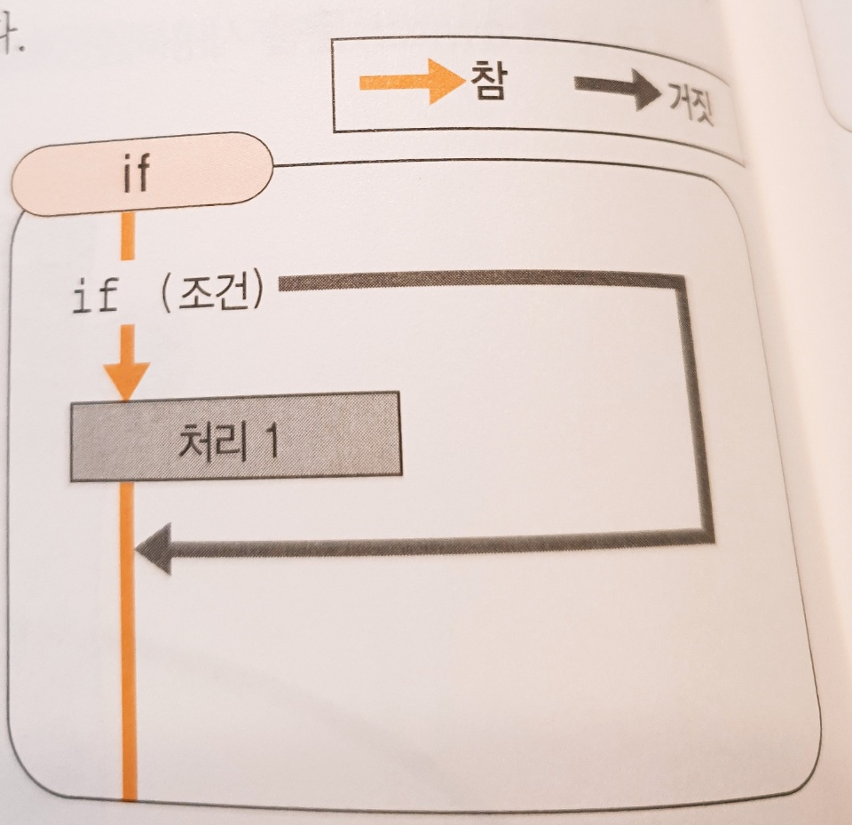
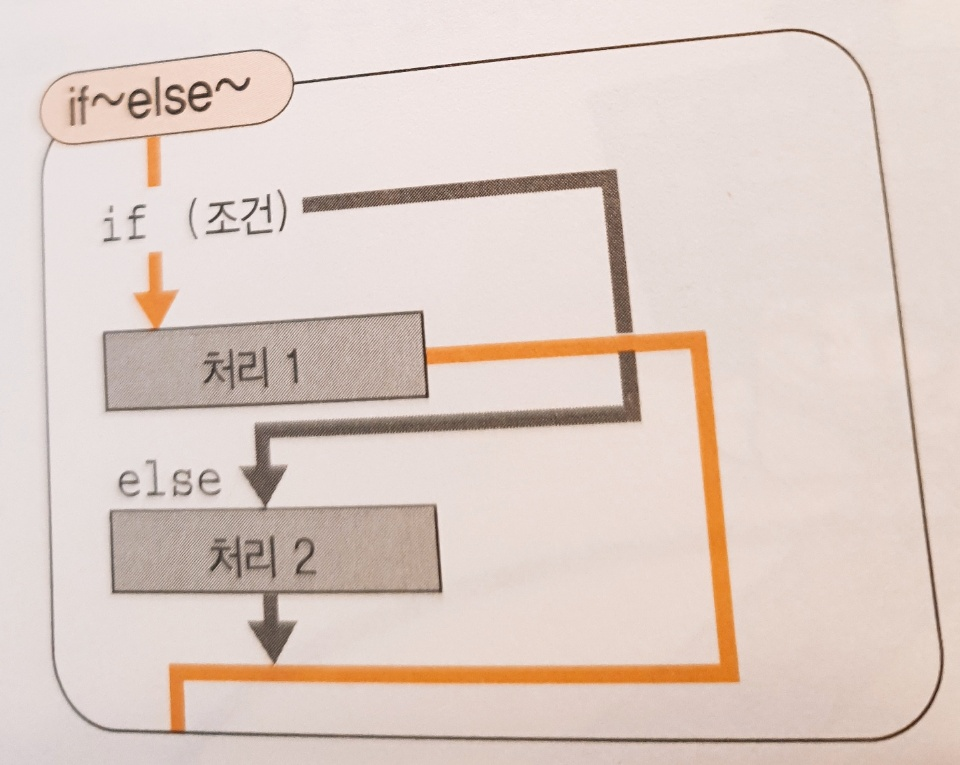
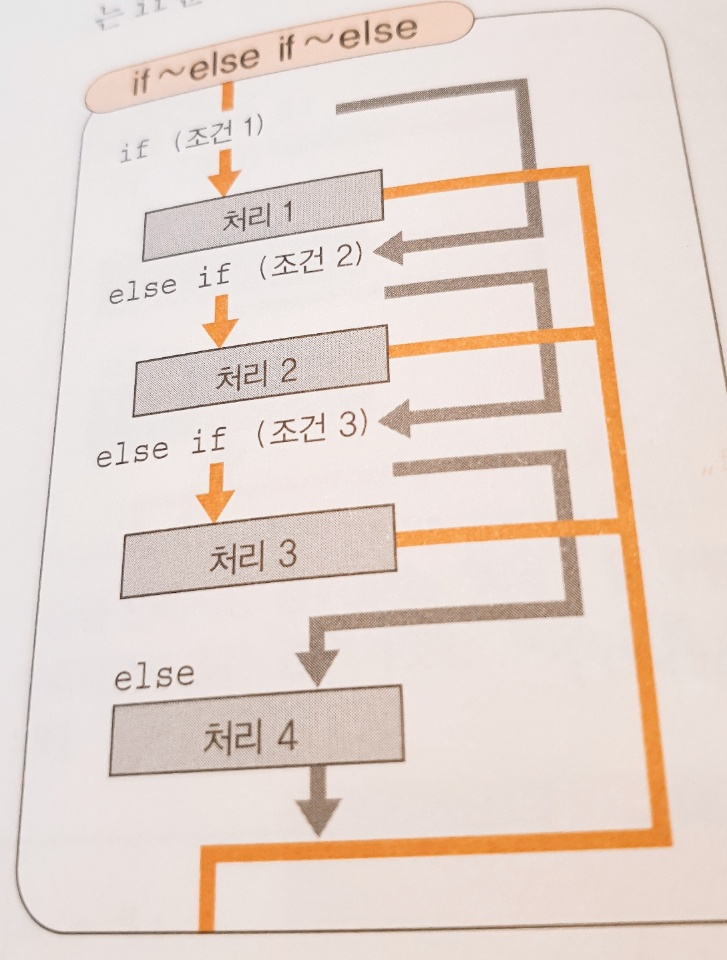
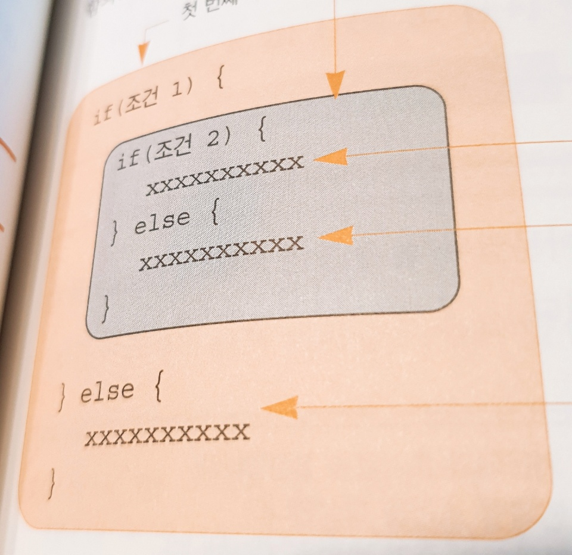
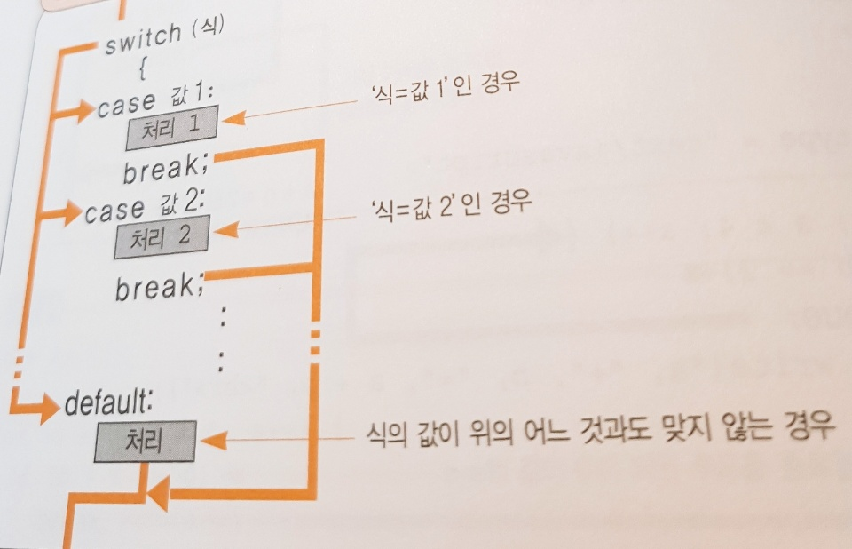
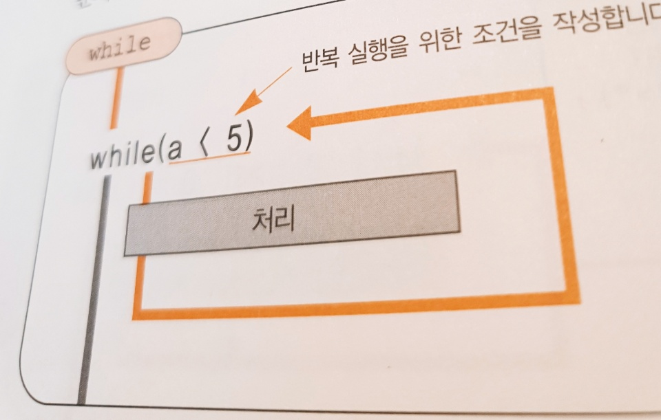
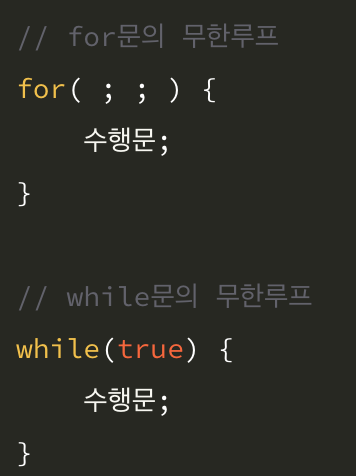
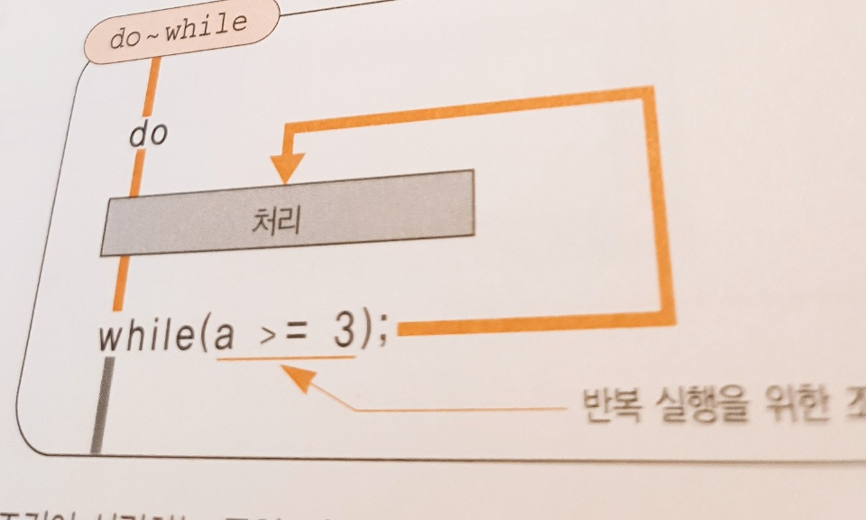

# 제어문

--

작성자 : 스칼렛

--

## 제어문\(조건문\)

프로그래밍을 할 때 자주 사용하는 구문임.

필요에 따라 프로그램의 흐름을 바꾸고 싶을 때 사용함.

프로그램은 위에서 아래로 흘러가지만, 그대로 사용하면 단순한 동작만 정의할 수 있음.

상황에 따라 '동일한 처리를 반복하고 싶다' 거나 '연산 결과에 따라 처리를 중지하고 싶은 경우'가 있음.

이럴 때 활약하는 것이 제어문임.

제어문을 사용하면 코드의 흐름을 되돌리거나 막을 수 있음.

* if : '만일 ~하면 ~한다' 라는 조건 분기를 만드는 제어문→ 성립한 경우와 성립하지 않는 경우의 흐름을 준비할 수 있다는 것.

  일상 생활에도 많이 쓰고 있음.

  '신호등이 초록불로 바뀌면 건넌다.'

  '오늘 이 업무를 다 하지 않으면 퇴근을 할 수 없다... 얼른 끝내고 칼퇴하자.'

  \(비슷한 성격을 지닌 switch도 있음⇒ 흐름의 분기가 많을 때 사용\)

  신호등의 색이

  빨간불이면 ⇒ 차가 멈춘다

  노란불이면 ⇒ 서행한다

  초록불이면 ⇒ 쌩쌩 달린다

  이 때 신호등의 색이 기준점이 된다.

* for문 while 문 : '반복'해서 처리하고 싶을 때 사용함.

  놀이기구로 치면 회전목마로 예를 들 수 있음.

  회전 목마가 특정 시간 동안, 특정 속도로 \(물론 타는 말마다 특정 높이가 달라지긴하지만 달라지면서도 위, 아래 왔다갔다함\) 뱅글뱅글 돌기만 함.

  마크업으로 치면 이런 구문인데

  ```markup
  <ul>
    <li>메뉴1</li>
    <li>메뉴2</li>
    <li>메뉴3</li>
  </ul>
  ```

  **quiz1. 여기서 잠시 규칙을 찾으시오.**

* break문, cotinue문 : 반복의 흐름을 바꿈.
* 무한루프 : 영원히 반복되는 루프.

### 1.IF '만일 ~ 하면'

조건에 따라 다르게 처리하고 싶을 때 사용.

조건에는 비교 연산자나 논리 연산자를 사용하여 조건식을 지정함.

**quiz2. 여기서 잠시 비교 연산자와 논리 연산자에는 어떤 것이 있었나요?**



만일 ~ 라면에 해당하는 구문.

조건을 만족 시킨 경우 '처리1'을 수행, 만족 시키지 않은 경우는 아무 일도 하지 않음.

```javascript
var isDoneWork=true;
if(isDoneWork) { // isDoneWork이 true인 경우
    alert("칼퇴");
}
```



'만일 ~ 이면 처리1을 하고 그렇지 않으면 처리2를 함'

```javascript
var isDoneWork=true;
var sendToBoss = function (msg) {
    console.log(msg);
};
if (isDoneWork) { // isDoneWork이 true인 경우
    alert("칼퇴");                                   // ----1
    sendToBoss("오늘은 칼퇴 하겠습니다. 저를 찾지 마세요.");// ----2
} else {
    alert("슬프지만...야근이네요");
    sendToBoss("비록 칼퇴는 못했지만, 칼퇴 같은 속도로 빨리 끝낼꺼에요.");
}
```

여러 개로 처리하고 싶을 때 중괄호로 묶어서 한 덩어리리로 만드는데

\(사실..하나만 처리할 경우 한 줄로 쓸 수 있지만 컨벤션에 어긋나고, 가독성 적인 측면에서도 좋지 않아서 중괄호를 포함한 코드를 기술한다. 아래의 코드\)

```javascript
var isDoneWork=true;
var sendToBoss = function (msg) {
    console.log(msg);
};
if (isDoneWork) alert("칼퇴"); else alert("슬프지만...야근이네요");
```



'만일 ~ 라면, 아니면 ~ 라면, 아니면 ~ 라면, ..., 모두 아니라면' 이 조건문 중 실행되는 건 하나이다.

대표적인 예가 회원 가입 시 vaildation 체크이다.

### 내포 if문 \(=중첩 if문\)

if문을 비롯한 제어문에서는 처리 안에 제어문을 포함시킬 수 있음.

이렇게 포함되는 제어문을 '네스트\(nest\)'라고 함.



```javascript
var inpNameValue="guest";
var inpPasswordValue="**1234";
var code = 1001;
var codeInfo = {
    1001 : "아이디 또는 비밀번호를 확인해주세요.",
    1002 : "아이디가 존재하지 않습니다."
};
// 해당 코드는 로그인을 서버에서 응답코드를 받았을 때의 상황을 가정한 코드임.

if(inpNameValue && inpPasswordValue)
{
    if(code==1001) {
        alert(codeInfo[1001]);
        console.log("아이디 또는 비밀번호를 확인해주세요.");
    } else {
        alert(codeInfo[1002]);    
        console.log("아이디가 존재하지 않습니다.");
    }
} else {
    alert("아이디 또는 비밀번호 입력 해주세요.");
}
```

### 2.switch문

여러 개의 case라는 선택 사항 중에서 식의 값에 맞는 것을 골라 처리함.

식의 값이 어느 case 와도 맞지 않는 경우는 default로 넘어감.

각 선택 사항의 맨 뒤에는 break문을 기술하여 선택한 처리만 수행하도록 함.



\*\* break가 없으면 그냥 통과해서 모두 처리함!!

```javascript
var signalColor="yellow";

switch(signalColor) {
    case "yellow" :
        alert("서행하세요.");
        break;
    case "red" :
        alert("멈추세요.");
        break;
    default :
        alert("달리세요.");
        break;
}

var signalColor=window.prompt("신호등 코드를 입력하세요. \n 1 : yellow \n 2 : red \n 3 : green");

switch(signalColor) {
    case "1" :
        alert("서행하세요.");
        break;
    case "2" :
        alert("멈추세요.");
        break;
    default :
        alert("달리세요.");
        break;
}
```

값은 숫자도 가능함.

```javascript
var signalColor=0;

switch(signalColor) {
    case 0 :
        alert("서행하세요.");
    case 1 :
        alert("멈추세요.");
    default :
        alert("달리세요.");
}
```

\*\* 조건문을 쓰지 않을 수는 없음. 하지만 상황에 맞게, 예쁘게 잘 쓸 수 있다면 잘 써야함.

### 3.for문

* for문 쉽게 이해하기.pdf


* 자바스크립트에서  for문의 종류는 for ... in, for ... of, forEach ... 등등 이 있음.

### 2중 for문\(루프\)

두 개의 for문을 사용하면 반복 실행하는 도중에 다른 반복 실행문을 작성할 수 있음.

```javascript
for(var j=1;j<=9;j++) {
    document.write(j,"단 <br>");
    for(var i=1;i<=9;i++) {
        document.write(j,"x",i,"=",j*i,"<br>");        
    }
}
```


### while 문

어떤 조건이 성립하는 동안만 반복 처리를 실행하는 제어문. 카운터에 해당하는 것이 없고 주로 반복할 횟수를 모를 때 사용함.




quiz3. 여기서 for문과 while의 차이점은?

소괄호 안에 조건식만 들어감.

### 무한루프

반복 제어문에서는 실수로 항상 성립하는 조건을 지정하면 영원히 반복을 수행하여 처리함.

이는 버그의 오류의 원인이 됨.



```javascript
var i=0;
var arr=[1,2,3];
for(i;arr;i++) {
    console.log("result???????");
}
```

quiz4. 코드로만 봤을 때 위의 코드를 실행하면?

quiz5. 이를 해결하기 위해서는?



while와 마찬가지로 반복을 수행하는 제어문.

while문에서는 조건을 먼저 작성하므로, 맨 처음에 조건이 성립하지 않으면 한 번도 처리하지 않음.

do~ while은 조건을 아래에 작성하므로 반드시 한 번은 처리를 실행함.

### 루프 중단하기

반복문 등에서 흐름을 바꿀 때 사용하는 break문과 continue가 있음.

```javascript
var b=2;
    for(var a=0;a<5;a++) {
        if(b-a===0) {
            break;
        }
        console.log(b,a,"b-a=",b-a);
    }

var c=1;
for(var d=0;d<4;d++) {
    if(a+b ==2){
        continue;
    }
console.log(b,a,"b+a=",b+a);
}
```

